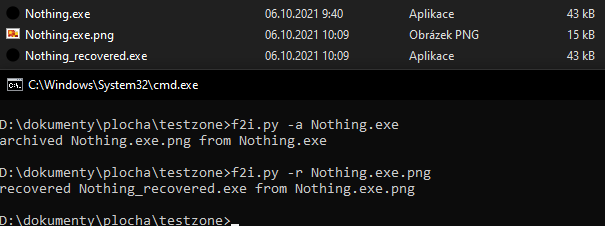

# file2bmp55
conversts a file to a 255 colors bmp

## Showcase

A picture is worth a thousand words. 
In this showcase you can see me converting an exe file to png and back. 
(you can check out [KoleckOLP](https://github.com/KoleckOLP) / [Nothing](https://github.com/KoleckOLP/Nothing) or get a release [here](https://github.com/KoleckOLP/Nothing/releases/tag/1.1.1.0))  
here is the resulting png btw

### eh
The original implemantation was made on 2021-08-23, the original original plan was to turn files into images, compress them and than uncompress them and turn them back. 
This never happened and the project was canned, I only used to to look at the hex reperesentation of files in a graphical way. 
Aslo if you feed it a 256 color bit map it will spit a cursed version back.

### How it was almost lost
I tought the source code was lost because I reformat my pc yearly only keeping files i actually use and stuff, losing a lot of stuff in the process usually. 
But it turns out that I have send a working finished code to a friend on discord (thx LMB love ya <3)

### Future
The plan now is to at least improve the code a bit and keep it as a funny thing.

### sort of a footer
So in the end this is not a very good method to compress files, resulting file is never smaller than a zip or a z7 would be (actually usually bigger than the original file) 
But this was a really fun project to make!
